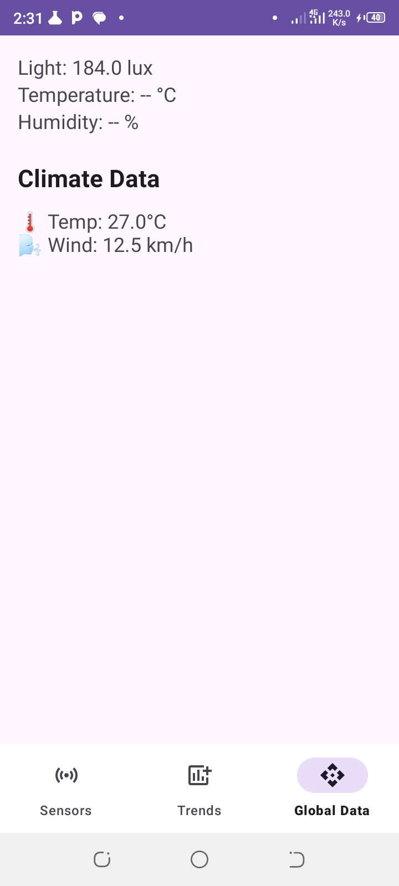
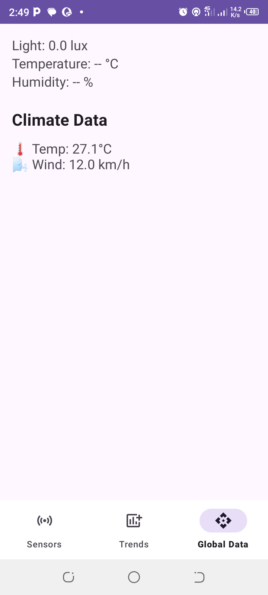
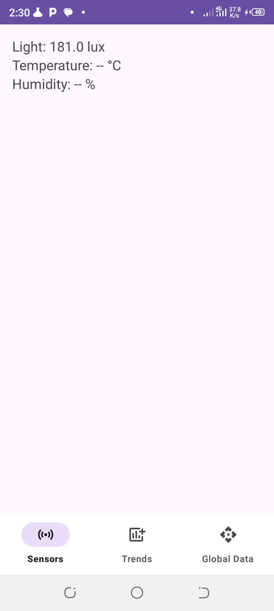
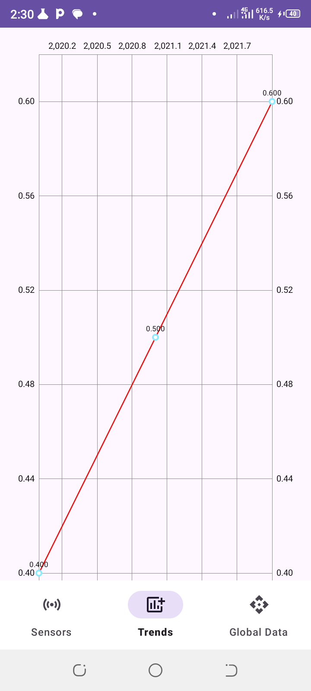
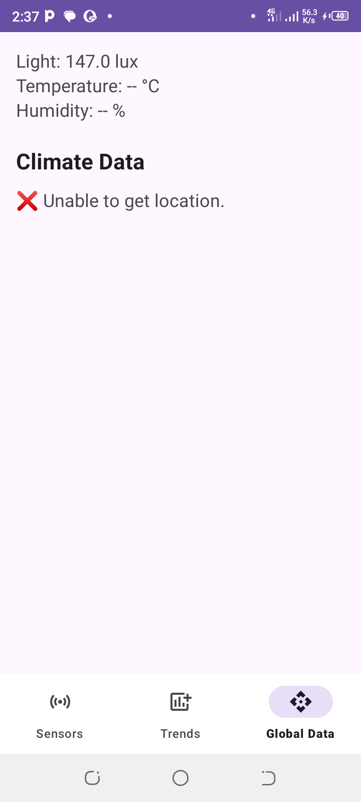

# 🌍 Climate Change Awareness App

An educational Android app developed in **Kotlin** using **Android Studio 2024.2.2**, aimed at promoting awareness about climate change. It utilizes device **sensors** and the **Open-Meteo API** to present live environmental data.

## 📲 Features

### 🔹 Real-Time Climate Data
- Fetches and displays current temperature and wind speed based on the user's location using the [Open-Meteo API](https://open-meteo.com/).

### 🔹 Sensor Data Monitoring
- Uses the device’s built-in sensors (if available) to display:
  - **Ambient Temperature**
  - **Humidity**
  - **Light Intensity**

### 🔹 User Interface
- Easy-to-navigate interface using fragments.
- Displays both sensor and online weather data.
- Organized layout with conditional visibility based on available sensors.

### 🔹 Permissions
- Requires **location permission** to retrieve weather data for the user's area.

---

## 🔧 Technologies Used

- **Kotlin**
- **Coroutines** with `lifecycleScope` for background API calls
- **ViewBinding**
- **Retrofit** for network operations
- **SensorManager** for real-time sensor access

---

## 🧪 Screenshots

### 🌡️ Weather and Sensor Data


### 📉 Only Climate Data When Sensors Are Missing


### 📉 Only Sensors Data (- for sensor absence)


### 📉 Trends Plot


### 📛 Error Handling


---

## 🚀 Getting Started

### Prerequisites

- Android Studio 2024.2.2 or later
- Kotlin 1.9+
- Minimum SDK: 21 (Lollipop)

### Setup

```bash
git clone https://github.com/Kotlin-Charts-Summer-2025-P-T/Mobile-Climate-Change-Awareness-App.git
cd Mobile-Climate-Change-Awareness-App
